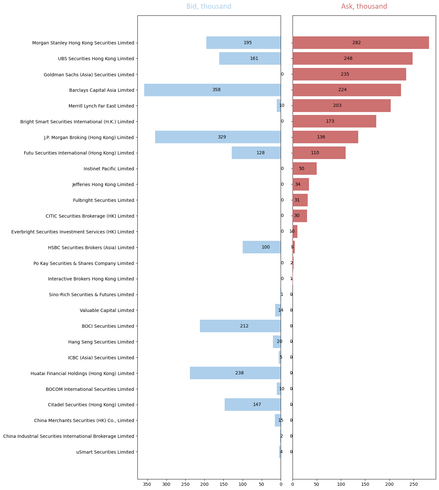

# BPIPE Project Specification

## Data Types (for HKEx)

### 1. TOP (Top Brokers)

`'MKTDEPTH_EVENT_TYPE' == 'MARKET_BY_ORDER' and 'EID' == 14112`

* Broker ID
* Queue position at that price level
* Bid / Offer price
* **Does not show size**
* Timestamp (rounded to seconds, due to Bloomberg Backend Issues) when the order was *submited*

### 2. MBO (Market By Order)

`'MKTDEPTH_EVENT_TYPE' == 'MARKET_BY_ORDER' and 'EID' == 53714`

* **Does not show Broker ID**
* Queue position at that price level
* Bid / Offer price
* Size
* Timestamp (accruate to the miliseconds) when the order was *updated* (for example partially filled and outstanding size changes)

### 3. MBL (Market By Level)

`'MKTDEPTH_EVENT_TYPE' == 'MARKET_BY_LEVEL' and 'EID' == 14112`

* Number of orders at each price level
* Total Size of all orders at each price level
* Price Level
* Timestamp (accruate to the miliseconds)

### 4. TRADE

`'MKTDATA_EVENT_TYPE' == 'TRADE'`. A free data stream that does not require BPIPE subscription.

* Traded Price
* Traded Size
* Condition Code of Trade, [more information on HKEx](https://www.hkex.com.hk/Services/Trading/Securities/Overview/Trading-Mechanism?sc_lang=en)
* Time of execution (accruate to the miliseconds)

## Target output

### 1. Journal of all broker activities
| Timestamp  | Broker ID | Price | Side | Size  | Action         |
| ---------- | --------- | ----- | ---- | ----- | -------------- |
| 9:30:14:35 | 6996      | 2.38  | Ask  | 88000 | New Order      |
| 9:31:24:15 | 6996      | 2.38  | Ask  | 2000  | Trade Executed |
| 9:35:21:05 | 6996      | 2.38  | Ask  | 86000 | Removed Order  |

### 2. Visalization of Broker Activities
